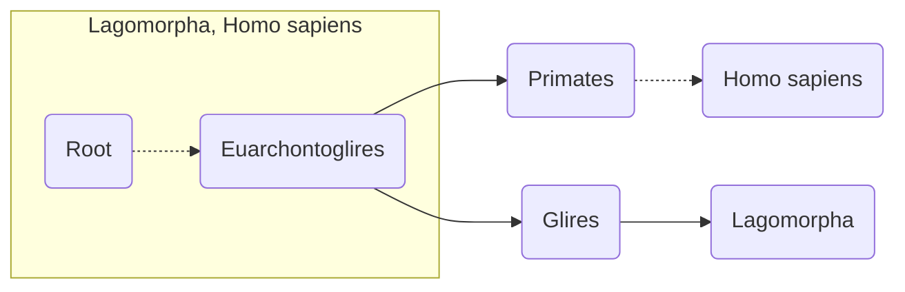
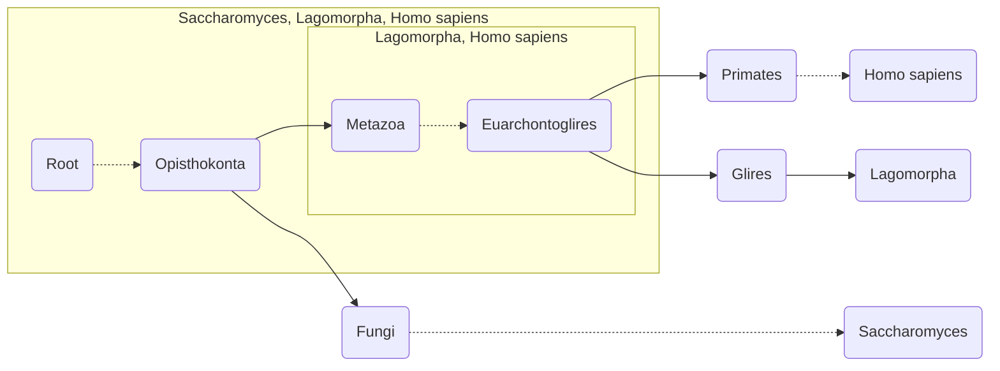
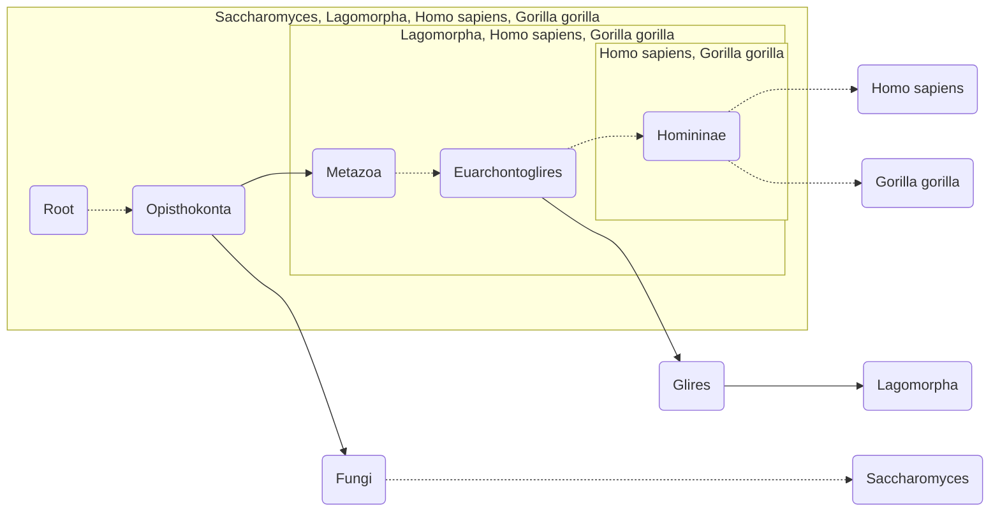

# Guide

## Initializing a taxonomy database in a `TaxDb` object

To get started, you need to create a [`TaxDb`][taxopy.TaxDb] object, which will store data related to the taxonomic database, such as taxonomic identifiers (or TaxIds), names, and hierarchies. This can be achieved by downloading the set of files that store this data, known as [taxdump](https://ftp.ncbi.nlm.nih.gov/pub/taxonomy/taxdump_readme.txt), from an online source (NCBI by default) or by providing your own taxdump files.

=== "Downloading from NCBI"

    ```pycon
    >>> import taxopy
    >>> taxdb = taxopy.TaxDb()# (1)!
    ```

    1. By default, `taxopy` deletes the taxdump files after creating the object. To retain the files in the working directory, set `keep_files=True`. You can specify the directory where the files are stored using the `taxdb_dir` parameter.

=== "Downloading from a different source"

    ```pycon
    >>> import taxopy
    >>> url = "https://github.com/shenwei356/gtdb-taxdump/releases/download/v0.5.0/gtdb-taxdump-R220.tar.gz"
    >>> taxdb = taxopy.TaxDb(
    ...     taxdump_url=url# (1)!
    ... )
    ```

    1. The `taxdump_url` parameter is used to specify the URL of the taxdump file to download. In this case, we are using a [custom a GTDB taxdump provided by Wei Shen](https://github.com/shenwei356/gtdb-taxdump).

=== "Local taxdump"

    ```pycon
    >>> import taxopy
    >>> taxdb = taxopy.TaxDb(
    ...     nodes_dmp="taxdb/nodes.dmp",
    ...     names_dmp="taxdb/names.dmp",
    ...     merged_dmp="taxdb/merged.dmp",# (1)!
    ... )
    ```

    1. The `merged_dmp` parameter is optional. However, if you want to support legacy TaxIds (those merged into other identifiers), you need to provide a `merged.dmp` file. This is not necessary if the data is downloaded from an online source, which will include its own merged.dmp file.

The [`TaxDb`][taxopy.TaxDb] object stores the names, ranks, and parent-child relationships of all taxa, each represented by their respective TaxIds. For instance, [TaxId 2](https://www.ncbi.nlm.nih.gov/datasets/taxonomy/2/) corresponds to the "*Bacteria*" taxon, which has the rank of superkingdom. The parent taxon of *Bacteria* is [TaxId 131567](https://www.ncbi.nlm.nih.gov/datasets/taxonomy/131567/), corresponding to "*cellular organisms*".

```pycon
>>> print(taxdb.taxid2name[2])
Bacteria
>>> print(taxdb.taxid2rank[2])
superkingdom
>>> print(taxdb.taxid2parent[2])
131567
```

To retrieve the TaxId to which a legacy TaxId has been merged, you can use the `oldtaxid2newtaxid` attribute. For instance, the legacy TaxIds 260 and 29537 have been merged into [TaxId 143224](https://www.ncbi.nlm.nih.gov/datasets/taxonomy/143224/) ("*Zobellia uliginosa*").

```pycon
>>> print(taxdb.oldtaxid2newtaxid[260])
143224
>>> print(taxdb.oldtaxid2newtaxid[29537])
143224
```

## The `Taxon` object

[`Taxon`][taxopy.Taxon] objects represent individual taxa within the taxonomy database. These objects are initialized using a TaxId and a corresponding [`TaxDb`][taxopy.TaxDb] object, from which the taxon data is retrieved.

```pycon
>>> saccharomyces = taxopy.Taxon(4930, taxdb)
>>> human = taxopy.Taxon(9606, taxdb)
>>> gorilla = taxopy.Taxon(9593, taxdb)
>>> lagomorpha = taxopy.Taxon(9975, taxdb)
```

Each [`Taxon`][taxopy.Taxon] object stores various data related to the taxon, including its TaxId, names, rank, and lineage. The lineage data comprises the TaxIds, scientific names, and ranks of its parent taxa.

```pycon
>>> print(lagomorpha.taxid)
9975
>>> print(lagomorpha.taxid_lineage)
[9975, 314147, 314146, 1437010, 9347, 32525, 40674, 32524, 32523, 1338369, 8287, 117571, 117570, 7776, 7742, 89593, 7711, 33511, 33213, 6072, 33208, 33154, 2759, 131567, 1]
>>> print(lagomorpha.ranked_taxid_lineage)
[('order', 9975), ('clade', 314147), ('superorder', 314146), ('clade', 1437010), ('clade', 9347), ('clade', 32525), ('class', 40674), ('clade', 32524), ('clade', 32523), ('clade', 1338369), ('superclass', 8287), ('clade', 117571), ('clade', 117570), ('clade', 7776), ('clade', 7742), ('subphylum', 89593), ('phylum', 7711), ('clade', 33511), ('clade', 33213), ('clade', 6072), ('kingdom', 33208), ('clade', 33154), ('superkingdom', 2759), ('no rank', 131567), ('no rank', 1)]
>>> print(lagomorpha.name)
Lagomorpha
>>> print(lagomorpha.all_names)
{'authority': ['Lagomorpha Brandt, 1855'], 'scientific name': ['Lagomorpha'], 'blast name': ['rabbits & hares']}
>>> print(lagomorpha.name_lineage)
['Lagomorpha', 'Glires', 'Euarchontoglires', 'Boreoeutheria', 'Eutheria', 'Theria', 'Mammalia', 'Amniota', 'Tetrapoda', 'Dipnotetrapodomorpha', 'Sarcopterygii', 'Euteleostomi', 'Teleostomi', 'Gnathostomata', 'Vertebrata', 'Craniata', 'Chordata', 'Deuterostomia', 'Bilateria', 'Eumetazoa', 'Metazoa', 'Opisthokonta', 'Eukaryota', 'cellular organisms', 'root']
>>> print(lagomorpha.ranked_name_lineage)
[('order', 'Lagomorpha'), ('clade', 'Glires'), ('superorder', 'Euarchontoglires'), ('clade', 'Boreoeutheria'), ('clade', 'Eutheria'), ('clade', 'Theria'), ('class', 'Mammalia'), ('clade', 'Amniota'), ('clade', 'Tetrapoda'), ('clade', 'Dipnotetrapodomorpha'), ('superclass', 'Sarcopterygii'), ('clade', 'Euteleostomi'), ('clade', 'Teleostomi'), ('clade', 'Gnathostomata'), ('clade', 'Vertebrata'), ('subphylum', 'Craniata'), ('phylum', 'Chordata'), ('clade', 'Deuterostomia'), ('clade', 'Bilateria'), ('clade', 'Eumetazoa'), ('kingdom', 'Metazoa'), ('clade', 'Opisthokonta'), ('superkingdom', 'Eukaryota'), ('no rank', 'cellular organisms'), ('no rank', 'root')]
>>> print(lagomorpha.rank_name_dictionary)
OrderedDict({'order': 'Lagomorpha', 'clade': 'Opisthokonta', 'superorder': 'Euarchontoglires', 'class': 'Mammalia', 'superclass': 'Sarcopterygii', 'subphylum': 'Craniata', 'phylum': 'Chordata', 'kingdom': 'Metazoa', 'superkingdom': 'Eukaryota'})
>>> print(lagomorpha.rank)
order
```

A taxon's scientific name is stored in the `name` field, while `all_names` is a dictionary from the kind of name to a list of names. 

```pycon
>>> sus = taxopy.Taxon(9823, taxdb)
>>> print(sus.name)
'Sus scrofa'
>>> print(sus.all_names)
{'genbank common name': ['pig'], 'common name': ['pigs', 'swine', 'wild boar'], 'authority': ['Sus scrofa Linnaeus, 1758'], 'includes': ['Sus scrofa LW', 'Sus scrofa Pietrain'], 'scientific name': ['Sus scrofa']}
>>> print(sus.all_names['common name'])
['pigs', 'swine', 'wild boar']
```

To obtain the [`Taxon`][taxopy.Taxon] object for the parent of a specified taxon, you can use the `parent` method.

```pycon
>>> saccharomyces_parent = saccharomyces.parent(taxdb)
>>> print(saccharomyces_parent.name)
Saccharomycetaceae
>>> print(saccharomyces_parent.rank)
family
```

## Identifying taxa shared between multiple lineages

Due to the hierarchical nature of taxonomies, different taxa may share common ancestors at one or more ranks in their lineages. For example, the *Lagomorpha* and *Homo sapiens* lineages have common taxa from the root of the taxonomy (parent to all other taxa) up until *Euarchontoglires*, from which they then diverge.


In `taxopy`, [`Taxon`][taxopy.Taxon] objects store the lineage data for each taxon, enabling the identification of shared taxa between two or more lineages. `taxopy` provides two functions for this purpose:

- [`find_lca`][taxopy.find_lca]: Identifies the most specific taxon shared among all provided lineages.
- [`find_majority_vote`][taxopy.find_majority_vote]: Identifies the most specific taxon common to more than a specified fraction of the provided lineages (default is more than 50%).

### Lowest common ancestor

The lowest common ancestor (LCA) of a set of taxa is the most specific taxon that is common to all the lineages. In the example above, the LCA between *Lagomorpha* and *Homo sapiens* is the *Euarchontoglires* superorder. This can be easily determined using `taxopy` through the [`find_lca`][taxopy.find_lca].

```pycon
>>> print(taxopy.find_lca([lagomorpha, human], taxdb).name)
Euarchontoglires
```

### Majority vote

The LCA can be uninformative when determining a representative taxon for a set of lineages. For instance, consider the lineages of *Lagomorpha*, *Homo sapiens*, and *Saccharomyces*.



*Saccharomyces* is very distantly related to both *Lagomorpha* and *Homo sapiens*, making the LCA of these three lineages *Opisthokonta*, a broad group within *Eukaryota* that includes both animals and fungi.

```pycon
>>> print(taxopy.find_lca([saccharomyces, lagomorpha, human], taxdb).name)
Opisthokonta
```

If you want to find a taxon that represents most of the lineages in a set, the LCA might be too broad if a single distantly related organism is included, which is especially common when working with a large set of lineages. Instead, you can use the [`find_majority_vote`][taxopy.find_majority_vote] function to determine the taxon shared by *most* of the lineages, but not necessarily *all* of them. This approach generally yields a more specific taxon than the LCA. In the example above, *Euarchontoglires* is the most specific taxon shared by more than half of the three lineages.

```pycon
>>> print(
...     taxopy.find_majority_vote(
...         [saccharomyces, lagomorpha, human], taxdb
...     ).name
... )
Euarchontoglires
```

#### The `fraction` parameter

By default, [`find_majority_vote`][taxopy.find_majority_vote] requires the taxon to be shared by more than half of the lineages. You can adjust this threshold by setting the `fraction` parameter to a value greater than `0` and less than `1` (default is `0.5`). Higher values will require the resulting taxon to be shared by more lineages, approaching the LCA.

Let's add *Gorilla gorilla* to the set of lineages we are investigating.



If we consider *Lagomorpha*, *Homo sapiens*, and *Gorilla gorilla* (ignoring *Saccharomyces* for now), the most specific taxon that is shared by more than half of these three taxa is *Homininae*, which is common to two of them. However, if we want to determine the most specific taxon that is common to more than two-thirds of the lineages, we can change the value of `fraction` to `0.67`. This will return *Euarchontoglires*, which, in this particular case, is also the LCA of the three lineages.

```pycon
>>> print(taxopy.find_majority_vote([lagomorpha, human, gorilla], taxdb).name)
Homininae
>>> print(
...     taxopy.find_majority_vote(
...         [lagomorpha, human, gorilla], taxdb, fraction=0.67
...     ).name
... )
Euarchontoglires
```

The level of agreement among the lineages used to find the common taxon is stored in the `agreement` attribute. This is computed as the ratio of the number of lineages in which the shared taxon is present to the total number of lineages used.

```pycon
>>> print(
...     taxopy.find_majority_vote(
...         [lagomorpha, human, gorilla], taxdb
...     ).agreement
... )
0.6666666666666666
>>> print(
...     taxopy.find_majority_vote(
...         [lagomorpha, human, gorilla], taxdb, fraction=0.67
...     ).agreement
... )
1.0
```

#### The `weights` parameter

[`find_majority_vote`][taxopy.find_majority_vote] also allows you to assign different weights to taxa when determining the shared taxon using the `weights` parameter. For example, the most specific taxon common to more than half of the four taxa in the figure above is *Euarchontoglires* (shared by three out of the four). However, if we set the weight of *Saccharomyces* to `3` and the weights of the remaining lineages to `1` each, the function will return *Opisthokonta*, effectively balancing the total weight of *Saccharomyces* with the three *Euarchontoglires* taxa.

```pycon
>>> print(
...     taxopy.find_majority_vote(
...         [saccharomyces, human, gorilla, lagomorpha], taxdb
...     ).name
... )
Euarchontoglires
>>> print(
...     taxopy.find_majority_vote(
...         [saccharomyces, human, gorilla, lagomorpha],
...         taxdb,
...         weights=[3, 1, 1, 1],
...     ).name
... )
Opisthokonta
```

This functionality is useful in various scenarios. For example, if you have a set of taxa with different numbers of individuals in a community, you can use the number of individuals of each taxon as weights to determine the most specific taxon common to more than half of the individuals. Another popular application is the taxonomic assignment of metagenomic sequences[^1]<sup>,</sup>[^2]. In this case, each gene within a sequence is assigned to a taxon through alignment to reference genes, and the confidence of these assignments (quantified as alignment scores) is used as weights to determine a representative taxon for the entire sequence.

## Retrieving TaxIds from taxa names

In many cases, you might have the names of taxa of interest but not their corresponding TaxIds. `taxopy` provides the [`taxid_from_name`][taxopy.taxid_from_name] function, which allows you to programmatically retrieve TaxIds based on taxa names. You can input a single scientific name or a list of names, and the function will return a list of TaxIds or a list of lists of TaxIds, respectively.

```pycon
>>> print(taxopy.taxid_from_name("Homininae", taxdb))
[207598]
>>> print(taxopy.taxid_from_name(["Homininae", "Homo sapiens"], taxdb))
[[207598], [9606]]
```

Some taxa may share the same name, which are known as homonyms. In such cases, the returned list will include multiple TaxIds.

```pycon
>>> print(taxopy.taxid_from_name("Aotus", taxdb))
[9504, 114498]
>>> for ti in taxopy.taxid_from_name(
...     ["Homininae", "Homo sapiens", "Aotus"], taxdb
... ):
...     print(f"{ti}:")
...     for t in ti:
...         taxon = taxopy.Taxon(t, taxdb)
...         parent_taxon = taxon.parent(taxdb)
...         print(f"{taxon.name} (TaxId: {t}, parent: {parent_taxon.name})")
[207598]:
Homininae (TaxId: 207598, parent: Hominidae)
[9606]:
Homo sapiens (TaxId: 9606, parent: Homo)
[9504, 114498]:
Aotus (TaxId: 9504, parent: Aotidae)
Aotus (TaxId: 114498, parent: Mirbelieae)
```

### Retrieval of taxa with nearly matching names though fuzzy search

When querying a [`TaxDb`][taxopy.TaxDb] using a taxon name, you can enable fuzzy search by setting the `fuzzy` parameter of [`taxid_from_name`][taxopy.taxid_from_name] to `True`. This allows the function to find taxa with names similar, but not identical, to the query string(s).

For a practical use case of this feature, consider the [GTDB](https://gtdb.ecogenomic.org/) taxonomy. In GTDB [some taxa have suffixes appended to their names](https://gtdb.ecogenomic.org/faq#why-do-some-family-and-higher-rank-names-end-with-an-alphabetic-suffix) because they are either not monophyletic in the GTDB reference tree or have unstable placements between different releases. By using fuzzy searches, you can find all the TaxIds representing a given taxon, such as *Myxococcota*, without needing to know in advance if any suffixes are appended to the name.

```pycon
>>> url = "https://github.com/shenwei356/gtdb-taxdump/releases/download/v0.5.0/gtdb-taxdump-R220.tar.gz"
>>> gtdb_taxdb = taxopy.TaxDb(taxdump_url=url)# (1)!
>>> for t in taxopy.taxid_from_name("Myxococcota", gtdb_taxdb, fuzzy=True):
...     print(taxopy.Taxon(t, gtdb_taxdb).name)
Myxococcota_A
Myxococcota
```

1. This custom GTDB taxdump was generated by Wei Shen using the [TaxonKit](https://bioinf.shenwei.me/taxonkit/) toolkit and is available for download from [GitHub](https://github.com/shenwei356/gtdb-taxdump).

You can adjust the minimum similarity threshold between the query string(s) and the matches in the database using the `score_cutoff` parameter, which determines how closely a name must match a query string to be considered a valid result. The default value is `0.9`, but you can lower this threshold to find matches that are less similar to the queries.

```pycon
>>> for t in taxopy.taxid_from_name(
...     "Myxococcota", gtdb_taxdb, fuzzy=True, score_cutoff=0.7
... ):
...     print(taxopy.Taxon(t, gtdb_taxdb).name)
Myxococcales
Myxococcota_A
Myxococcus
Myxococcia
Myxococcota
Myxococcaceae
```

[^1]: Von Meijenfeldt, F. A. B., Arkhipova, K., Cambuy, D. D., Coutinho, F. H. & Dutilh, B. E. "[Robust taxonomic classification of uncharted microbial sequences and bins with CAT and BAT](https://doi.org/10.1186/s13059-019-1817-x)". *Genome Biology* **20**, 217 (2019).
[^2]: Mirdita, M., Steinegger, M., Breitwieser, F., Söding, J. & Levy Karin, E. "[Fast and sensitive taxonomic assignment to metagenomic contigs](https://doi.org/10.1093/bioinformatics/btab184)". *Bioinformatics* **37**, 3029–3031 (2021).
